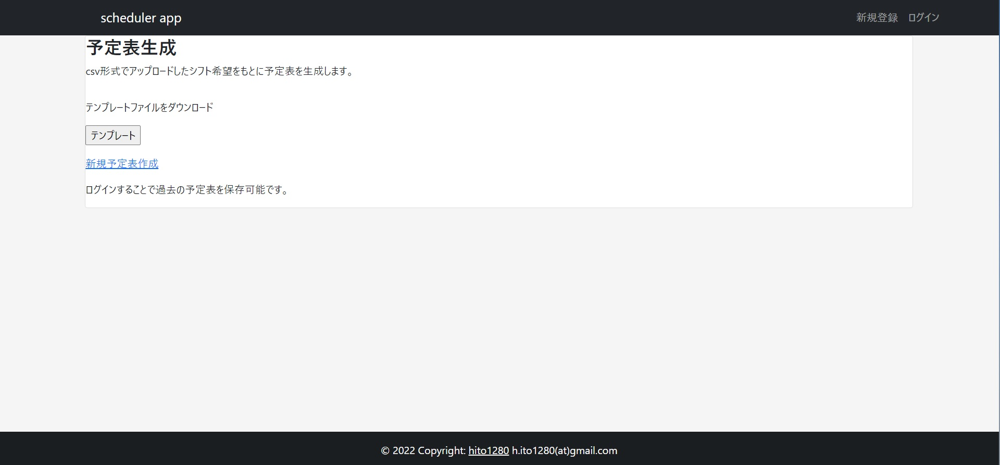
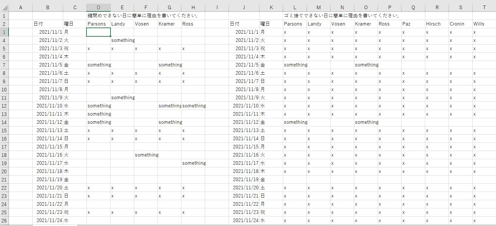
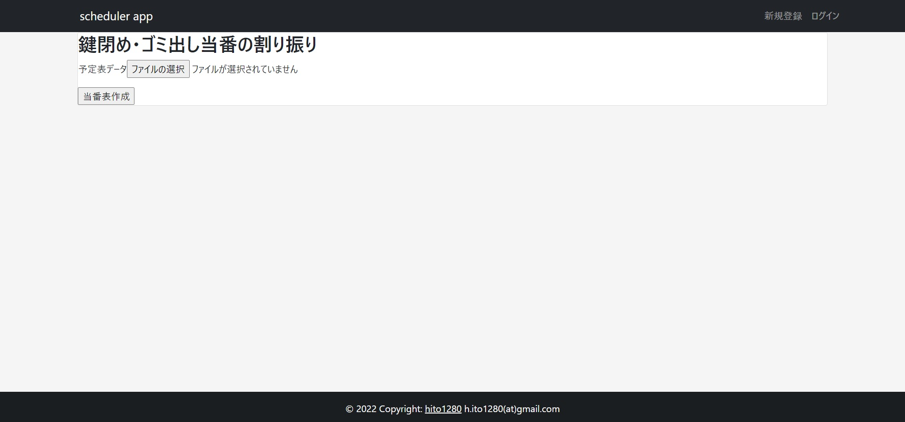
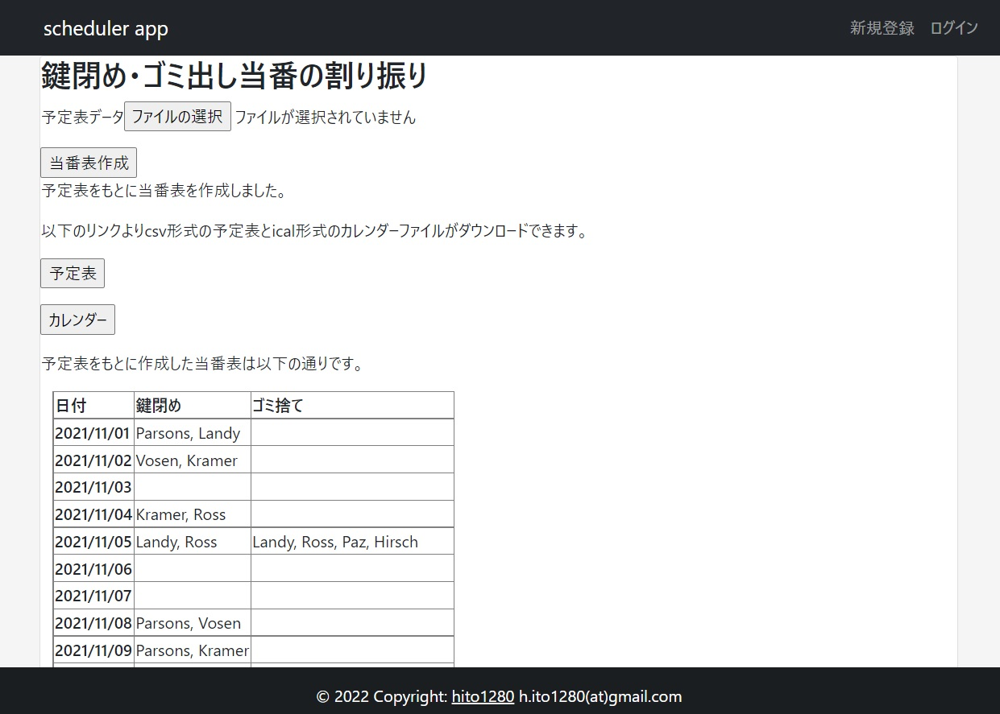
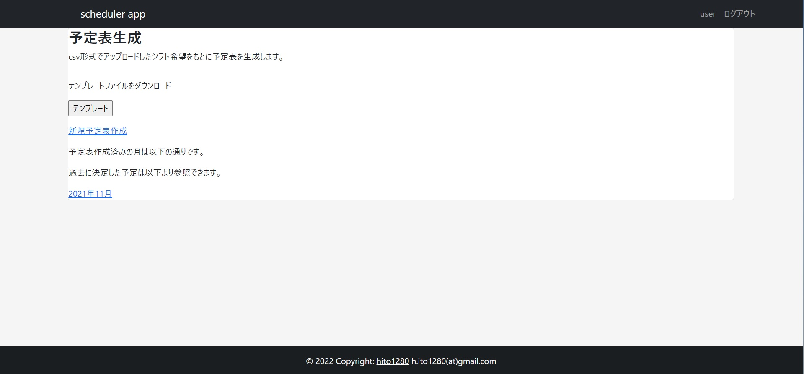
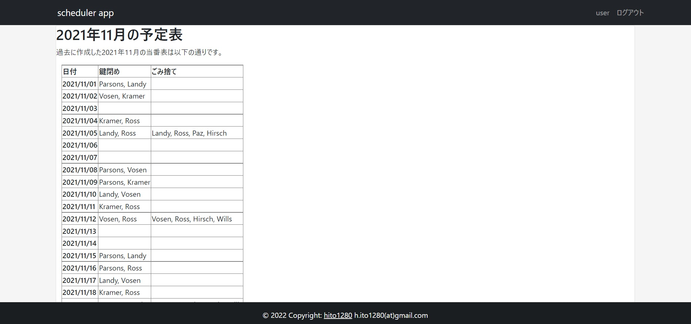

# 当番表生成アプリ

## 概要
csv形式の予定表（割り当て不可能な日を記入したもの）をアップロードすることで当番表を生成し、担当者ごとのカレンダーファイルを出力します。  
ユーザー登録することで、決めた当番表の保存と過去の当番表の参照ができます。

## 目的、作成経緯
研究室で鍵閉め、ごみ捨ての当番を毎月決める必要があり、これを定期実行させるプログラムを作成しました。プログラム中の当番表決定部分をWebアプリとして利用できる形にしたものがこのアプリです。  

### もととなった定期実行プログラムの作成経緯
前任者より引き継いだものは割り当て可能な人にランダムに割り振るもので週ごとの偏りなどが制御できていなかったためそれらの制約条件を付けた最適化問題を解く形にしました。同時に、各人の予定表を記入してもらうスプレッドシートの読み込み、決定した当番表のスプレッドシートへの書き込み、カレンダーファイルと合わせてメールで共有する機能をつけ、定期的に実行させることで省力化を目指しました。  
コードは以下を参照してください。

## 使用技術
言語：Python  
フレームワーク：Flask   
DB:SQLite  
装飾：Bootstrap，CSS  
コンテナ：Docker  
プラットフォーム：Google Cloud Run 
ソルバー：CBC（Coin-or branch and cut，[Python-MIP](https://www.python-mip.com/)に同梱のもの）　　

## 使い方
以下のURLよりアクセスしてください。
https://scheduler-app-lcd4uvejba-uc.a.run.app/

### テンプレートのcsvファイルのダウンロードと割り当て可能日の記入
このアプリではcsv形式の予定表をアップロードする必要があります。トップページよりテンプレートがダウンロード可能です。（テンプレートをクリックしてください。）

ダウンロードしたファイルをExcelまたは任意のエディタで編集してください。  
**Excelで文字化けする場合はいったんテキストエディタで開いたのち、.txt形式で保存してからExcelで開いてください。**

何らかの文字が入力されると割り当て不可能と判定します。全員割り当て不可能な日は割り当てする必要のない日と判定し、当番の割り当てを行いません。（例：画像中xで埋められた日）以下に注意して入力してください。

* **日付、名前および予定記入欄以外の場所に文字を入力しない**でください（Excelで開いた場合、B3:C33, D2:H33, J3:K33, L2:T33,にあたる部分以外は変更しないでください）。
* 人の追加、削減は可能ですが、**左の表（鍵閉め）に組み込んだ人は右側の表（ごみ捨て）にも必ず組み込んでください。**また、鍵閉めは割り当て可能な日には最大2人、ごみ捨ては最大4人を割り当てます。  
* ログイン時には作成した当番表はデータベースに保存されますが、**作成済みの月の判定は日付行の最上位のデータをもとに決定します。yyyy/mm/dd形式の正しい日付を入力し、ごみ捨て欄と一致させてください。**なお、曜日は当番表の決定には関与しないため正確な入力を必要としません。
* 入力した予定表はcsv形式で保存してください。  

### 予定表のアップロードと当番表の作成
トップページの新規予定表作成より以下の当番表作成画面に移動してください。

csv形式で保存した予定表は予定表データよりファイルを選択し、アップロードしてください。その後、当番表作成ボタンを押すことで当番表を生成します。

### 当番表とicalファイルのダウンロード

当番表作成ボタンを押すと割り当て結果が表示されます。予定表ボタンよりcsv形式での当番表が、カレンダーボタンを押すことで各人の担当する日付、一緒に担当する人が書かれたical形式のカレンダーファイルがそれぞれダウンロードできます。

ログイン状態で当番表の決定を行うと、過去に割り振りを行っていない月であればデータベースに新たに登録、過去に割り振りを行った月であればデータベースを更新します。

### ログイン・新規登録
各ページ右上のログインまたは新規登録より可能です。メールアドレスは有効なメールアドレス形式である必要がありますが、メールアドレスの認証は行っていません。

### 保存済みの過去の当番表の確認
ログイン中はトップページに過去に割り当てされた当番表の年月が表示されます。   

確認したい年月をクリックすると予定表が確認可能です。  

